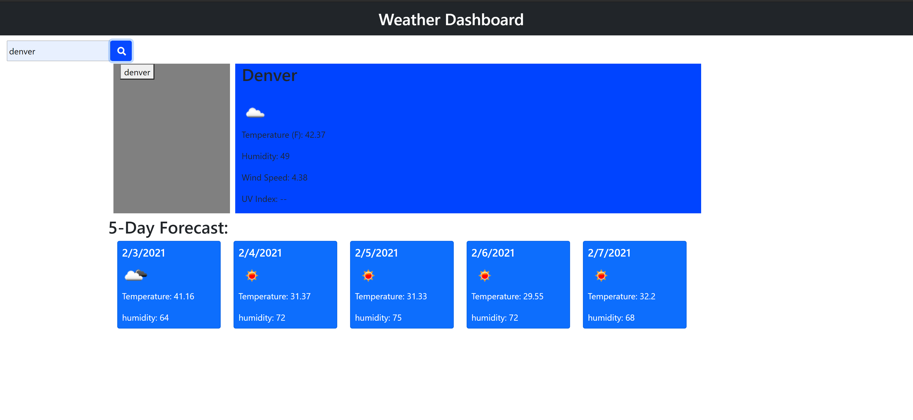

# du-weather-dashboard

## Description

In this project I created a weather dashboard that allows the user to see the weather based on the city they search. When the user searches the desired city the weather for that current day will be displayed. Along with that the weather for the next five days will be displayed below the current day.

## Questions
If you have any questions contact me at mrivera0014@gmail.com.
Find more of my work at (https://github.com/mrivera0014/)

## Screenshots

## Links

[Link to Github repository](https://github.com/mrivera0014/du-weather-dashboard)
 

[Link to deployed application](https://mrivera0014.github.io/du-weather-dashboard/)